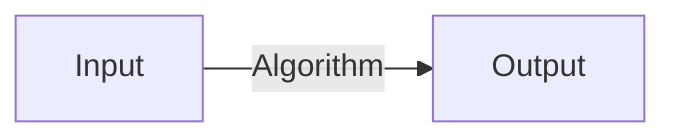

# Introduction to Quantum Computing

## Table of Contents

*   [Overview](#overview)
*   [I. From Bits to Qubits](#i-from-bits-to-qubits)
    *   [Classical Bits vs. Quantum Qubits](#classical-bits-vs-quantum-qubits)
    *   [Dirac Notation (Bra-Ket Notation)](#dirac-notation-bra-ket-notation)
    *   [Measurements](#measurements)
    *   [Bloch Sphere](#bloch-sphere)
*   [II. Quantum Circuits](#ii-quantum-circuits)
    *   [The Circuit Model](#the-circuit-model)
    *   [Single Qubit Gates](#single-qubit-gates)
    *   [Multipartite Quantum States (Multiple Qubits)](#multipartite-quantum-states-multiple-qubits)
    *   [Two-Qubit Gates](#two-qubit-gates)
*   [III. Entanglement](#iii-entanglement)
    *   [Bell States](#bell-states)
    *   [Quantum Teleportation](#quantum-teleportation)
    *   [Q-Sphere](#q-sphere)

## Overview

These notes serve as a foundational introduction to the key concepts of quantum computing, designed for beginners. We will cover:

I.  **From Bits to Qubits:** The transition from classical information units (`bits`) to their quantum counterparts (`qubits`). This includes understanding the core quantum properties of **superposition** and **measurement**, and learning the essential mathematical language of **Dirac notation** (using `kets` like $|ψ⟩$ and `bras` like $⟨ψ|$) and the **Bloch sphere** visualization.
II. **Quantum Circuits:** How quantum computations are structured using the circuit model. We'll explore fundamental **single-qubit gates** (like $X, Z, H, S$) and the crucial **two-qubit CNOT gate**, which manipulate qubit states. We will also learn how to describe systems containing multiple qubits using the **tensor product** ($⊗$).
III. **Entanglement:** Delving into the uniquely quantum phenomenon where qubits become deeply correlated. We will study the **Bell states** as prime examples of entanglement, understand the fascinating **quantum teleportation** protocol, and briefly introduce the **Q-sphere** for visualizing multi-qubit states.

---

## I. From Bits to Qubits

### Classical Bits vs. Quantum Qubits

*   **Classical Bits:** The fundamental unit of information in classical computers (like your laptop). A bit can only exist in one of two definite states: **0** or **1**. Think of it as a standard light switch - it must be either OFF (0) or ON (1).

*   **Quantum Qubits:** The fundamental unit of quantum information. A qubit utilizes principles of quantum mechanics. Like a bit, a qubit *can* be in state **0** or state **1**. However, it can also exist in a **superposition** of both states *simultaneously*.
    *   **Superposition:** This is a core quantum concept. Instead of being restricted to just 0 or 1, a qubit's state, denoted by $|ψ⟩$, can be a linear combination (a weighted sum) of the $|0⟩$ and $|1⟩$ states:
        $$
        |ψ⟩ = α|0⟩ + β|1⟩
        $$
        Here, $α$ (alpha) and $β$ (beta) are special numbers called **probability amplitudes**. They are **complex numbers** (numbers of the form $a + bi$, where $i = \sqrt{-1}$). The squares of their magnitudes, $|α|^2$ and $|β|^2$, represent the *probabilities* of finding the qubit in state $|0⟩$ or $|1⟩$, respectively, *if we measure it*. A key rule is that the probabilities must sum to 1:
        $$
        |α|^2 + |β|^2 = 1
        $$
        *Analogy:* Imagine a dimmer switch for a light. It's not just ON or OFF; it can be at various brightness levels in between. Superposition is more complex, involving these complex amplitudes, but this gives a hint that it's not just binary. A better analogy is a spinning coin: while spinning, it's neither heads nor tails but has the potential for both.

    *   **Computational Advantage:** The ability to exist in superposition allows a quantum computer with $n$ qubits to represent $2^n$ states simultaneously. This vast state space is what gives quantum computers the potential for exponential speed-ups on certain problems compared to classical computers, which can only represent one of $2^n$ states at a time.

*   **The Measurement Challenge:**
    *   Despite being in superposition, when we **measure** a qubit to find its value, its superposition state **collapses** into *one* definite classical state: either $|0⟩$ or $|1⟩$.
    *   The outcome is probabilistic, determined by the amplitudes: we get outcome 0 with probability $P(0) = |α|^2$ and outcome 1 with probability $P(1) = |β|^2$.
    *   We **cannot** directly observe the amplitudes $α$ and $β$ themselves, only the single classical result (0 or 1) after measurement. The rich quantum information encoded in the amplitudes is lost upon measurement for that specific qubit instance.
    *   **Quantum Algorithm Design:** Effective quantum algorithms don't rely on reading out all superposition states. They exploit another quantum phenomenon called **interference**. The complex nature of amplitudes means they have *phases*. Different computational paths in a quantum algorithm can interfere constructively (amplifying the probability of the correct answer) or destructively (canceling out the probabilities of wrong answers). Algorithms are cleverly designed so that when the final measurement is performed, the desired result is obtained with high probability.

### Dirac Notation (Bra-Ket Notation)

This is the standard mathematical notation used in quantum mechanics to represent quantum states and operations concisely. It utilizes vectors and linear algebra.

*   **Ket $|ψ⟩$**: Represents a quantum state (like the state of a qubit) as a **column vector** in a complex vector space (called Hilbert space).
    *   The fundamental basis states $|0⟩$ and $|1⟩$ for a single qubit are defined as orthogonal unit vectors:
        $$
        |0⟩ = \begin{pmatrix} 1 \\ 0 \end{pmatrix} \quad , \quad |1⟩ = \begin{pmatrix} 0 \\ 1 \end{pmatrix}
        $$
    *   A general single-qubit state $|ψ⟩ = α|0⟩ + β|1⟩$ is represented by the column vector:
        $$
        |ψ⟩ = α\begin{pmatrix} 1 \\ 0 \end{pmatrix} + β\begin{pmatrix} 0 \\ 1 \end{pmatrix} = \begin{pmatrix} α \\ β \end{pmatrix}
        $$
        where $α, β \in ℂ$ (complex numbers).

*   **Bra $⟨ψ|$**: Represents the **Hermitian conjugate** (also called adjoint) of the corresponding ket $|ψ⟩$. To get the bra from the ket:
    1.  **Transpose:** Turn the column vector into a row vector. $\begin{pmatrix} α \\ β \end{pmatrix} \rightarrow \begin{pmatrix} α & β \end{pmatrix}$
    2.  **Complex Conjugate:** Take the complex conjugate of each element. If $z = a + bi$, its complex conjugate is $z^* = a - bi$.
    So, if $|ψ⟩ = \begin{pmatrix} α \\ β \end{pmatrix}$, then the bra $⟨ψ|$ is the **row vector**:
    $$
    ⟨ψ| = |ψ⟩^† = \begin{pmatrix} α^* & β^* \end{pmatrix}
    $$
    (The symbol $†$, read "dagger", denotes the Hermitian conjugate).
    *   For the basis states:
        $$
        ⟨0| = \begin{pmatrix} 1 & 0 \end{pmatrix} \quad , \quad ⟨1| = \begin{pmatrix} 0 & 1 \end{pmatrix}
        $$
        (Since 1 and 0 are real numbers, their complex conjugates are themselves).

*   **Bra-Ket $⟨φ|ψ⟩$ (Inner Product)**: This denotes the inner product between two quantum states $|φ⟩$ and $|ψ⟩$. It's calculated using standard matrix multiplication: multiply the bra (row vector) $⟨φ|$ by the ket (column vector) $|ψ⟩$. The result is always a single **complex number** (a scalar).
    *   Let $|φ⟩ = \begin{pmatrix} γ \\ δ \end{pmatrix}$ and $|ψ⟩ = \begin{pmatrix} α \\ β \end{pmatrix}$. Then $⟨φ| = \begin{pmatrix} γ^* & δ^* \end{pmatrix}$.
    $$
    ⟨φ|ψ⟩ = \begin{pmatrix} γ^* & δ^* \end{pmatrix} \begin{pmatrix} α \\ β \end{pmatrix} = (γ^* \times α) + (δ^* \times β) \in ℂ
    $$
    *   **Properties & Meaning:**
        *   $⟨φ|ψ⟩ = (⟨ψ|φ⟩)^*$ (The order matters; swapping yields the complex conjugate).
        *   $⟨ψ|ψ⟩ = |α|^2 + |β|^2$, which is always a non-negative real number representing the squared norm (length) of the vector $|ψ⟩$.
        *   $|⟨φ|ψ⟩|^2$ is the probability of state $|ψ⟩$ collapsing to state $|φ⟩$ upon measurement in a basis containing $|φ⟩$. It quantifies the "overlap" between the states.

*   **Ket-Bra $|ψ⟩⟨φ|$ (Outer Product)**: This denotes the outer product. Multiply the ket $|ψ⟩$ (column vector) by the bra $⟨φ|$ (row vector). The result is a **matrix**, which acts as an **operator** that can transform other states.
    $$
    |ψ⟩⟨φ| = \begin{pmatrix} α \\ β \end{pmatrix} \begin{pmatrix} γ^* & δ^* \end{pmatrix} = \begin{pmatrix} α γ^* & α δ^* \\ β γ^* & β δ^* \end{pmatrix} \quad (\text{a } 2 \times 2 \text{ matrix for single qubits})
    $$
    *   **Example: Projection Operator:** The operator $P_0 = |0⟩⟨0|$ projects any state $|ψ⟩$ onto the $|0⟩$ state:
        $$
        P_0 = |0⟩⟨0| = \begin{pmatrix} 1 \\ 0 \end{pmatrix} \begin{pmatrix} 1^* & 0^* \end{pmatrix} = \begin{pmatrix} 1 \\ 0 \end{pmatrix} \begin{pmatrix} 1 & 0 \end{pmatrix} = \begin{pmatrix} 1 & 0 \\ 0 & 0 \end{pmatrix}
        $$
        Applying this to $|ψ⟩ = \begin{pmatrix} α \\ β \end{pmatrix}$:
        $$
        P_0 |ψ⟩ = \begin{pmatrix} 1 & 0 \\ 0 & 0 \end{pmatrix} \begin{pmatrix} α \\ β \end{pmatrix} = \begin{pmatrix} (1)(α) + (0)(β) \\ (0)(α) + (0)(β) \end{pmatrix} = \begin{pmatrix} α \\ 0 \end{pmatrix} = α|0⟩
        $$
        It successfully isolates the $|0⟩$ component of $|ψ⟩$. Similarly, $P_1 = |1⟩⟨1| = \begin{pmatrix} 0 & 0 \\ 0 & 1 \end{pmatrix}$ projects onto the $|1⟩$ state. Note that $P_0 + P_1 = I$ (the identity matrix).

*   **Orthogonality:** Two states $|φ⟩$ and $|ψ⟩$ are orthogonal if their inner product is zero: $⟨φ|ψ⟩ = 0$. The computational basis states $|0⟩$ and $|1⟩$ are orthogonal:
    $$
    ⟨0|1⟩ = \begin{pmatrix} 1 & 0 \end{pmatrix} \begin{pmatrix} 0 \\ 1 \end{pmatrix} = (1)(0) + (0)(1) = 0
    $$
    Orthogonal states represent mutually exclusive outcomes of a measurement.

*   **Normalization:** A quantum state vector must have a length (norm) of 1. This ensures the total probability of measuring *some* outcome is 100%.
    $$
    \sqrt{⟨ψ|ψ⟩} = 1 \quad \implies \quad ⟨ψ|ψ⟩ = 1
    $$
    For $|ψ⟩ = α|0⟩ + β|1⟩$, this means, as shown before:
    $$
    ⟨ψ|ψ⟩ = |α|^2 + |β|^2 = 1
    $$
    *   **Example:** Is the state $|φ⟩ = \frac{1+i}{2}|0⟩ + \frac{1}{\sqrt{2}}|1⟩$ properly normalized?
        *   $α = \frac{1+i}{2}$, $β = \frac{1}{\sqrt{2}}$
        *   $|α|^2 = \left|\frac{1+i}{2}\right|^2 = \frac{|1+i|^2}{|2|^2} = \frac{(\sqrt{1^2+1^2})^2}{4} = \frac{(\sqrt{2})^2}{4} = \frac{2}{4} = \frac{1}{2}$
        *   $|β|^2 = \left|\frac{1}{\sqrt{2}}\right|^2 = \frac{1^2}{(\sqrt{2})^2} = \frac{1}{2}$
        *   $|α|^2 + |β|^2 = \frac{1}{2} + \frac{1}{2} = 1$.
        *   Yes, the state $|φ⟩$ is correctly normalized.

---

### Measurements

Measurement is the process of extracting classical information (like a 0 or 1) from a quantum system. It's an active process that fundamentally alters the state.

*   **Projective Measurement:** Typically, measurements are performed with respect to a chosen **orthonormal basis** – a set of mutually orthogonal, normalized states that span the state space (like $\{|0⟩, |1⟩\}$ or $\{|+⟩, |-⟩\}$). When a measurement is made on state $|ψ⟩$ in the basis $\{|x_i⟩\}$, the state instantaneously **collapses** to one of the basis states $|x_k⟩$.
*   **Born Rule:** This fundamental postulate gives the probability $P(x_k)$ of the state $|ψ⟩$ collapsing to a specific basis state $|x_k⟩$:
    $$
    P(x_k) = |⟨x_k|ψ⟩|^2
    $$
    The state of the system *after* obtaining the outcome $x_k$ *becomes* $|x_k⟩$.
*   **Common Measurement Bases:**
    *   **Z-basis (Computational):** Basis $\{ |0⟩, |1⟩ \}$. Outcome is 0 or 1. Measures the projection onto the Z-axis of the Bloch sphere. This is the most common measurement.
    *   **X-basis:** Basis $\{ |+⟩, |-⟩ \}$. Outcome is '$+$' or '$-$'. Measures projection onto the X-axis.
        $$
        |+⟩ = \frac{1}{\sqrt{2}}(|0⟩ + |1⟩) \quad , \quad |-⟩ = \frac{1}{\sqrt{2}}(|0⟩ - |1⟩)
        $$
    *   **Y-basis:** Basis $\{ |+i⟩, |-i⟩ \}$. Outcome is '$+i$' or '$-i$'. Measures projection onto the Y-axis.
        $$
        |+i⟩ = \frac{1}{\sqrt{2}}(|0⟩ + i|1⟩) \quad , \quad |-i⟩ = \frac{1}{\sqrt{2}}(|0⟩ - i|1⟩)
        $$

*   **Detailed Measurement Example:**
    *   **State:** Let $|ψ⟩ = \frac{\sqrt{3}}{2}|0⟩ + \frac{i}{2}|1⟩$. (Check normalization: $(\sqrt{3}/2)^2 + |i/2|^2 = 3/4 + (1/2)^2 = 3/4 + 1/4 = 1$. OK.)
    *   **Measurement:** Measure in the **X-basis** $\{ |+⟩, |-⟩ \}$.
    *   **Probability of outcome '+':** $P(+) = |⟨+|ψ⟩|^2$.
        1.  Calculate the inner product $⟨+|ψ⟩$:
            $$
            ⟨+|ψ⟩ = \left( \frac{1}{\sqrt{2}}(⟨0| + ⟨1|) \right) \left( \frac{\sqrt{3}}{2}|0⟩ + \frac{i}{2}|1⟩ \right)
            $$
            Expand using linearity:
            $$
            = \frac{1}{\sqrt{2}} \left( ⟨0|\left(\frac{\sqrt{3}}{2}|0⟩ + \frac{i}{2}|1⟩\right) + ⟨1|\left(\frac{\sqrt{3}}{2}|0⟩ + \frac{i}{2}|1⟩\right) \right)
            $$
            $$
            = \frac{1}{\sqrt{2}} \left( \left(\frac{\sqrt{3}}{2}⟨0|0⟩ + \frac{i}{2}⟨0|1⟩\right) + \left(\frac{\sqrt{3}}{2}⟨1|0⟩ + \frac{i}{2}⟨1|1⟩\right) \right)
            $$
            Use orthogonality ($⟨0|1⟩=0, ⟨1|0⟩=0$) and normalization ($⟨0|0⟩=1, ⟨1|1⟩=1$):
            $$
            = \frac{1}{\sqrt{2}} \left( \left(\frac{\sqrt{3}}{2}(1) + \frac{i}{2}(0)\right) + \left(\frac{\sqrt{3}}{2}(0) + \frac{i}{2}(1)\right) \right)
            $$
            $$
            = \frac{1}{\sqrt{2}} \left( \frac{\sqrt{3}}{2} + \frac{i}{2} \right) = \frac{\sqrt{3}+i}{2\sqrt{2}}
            $$
        2.  Calculate the probability $P(+) = |⟨+|ψ⟩|^2$:
            $$
            P(+) = \left| \frac{\sqrt{3}+i}{2\sqrt{2}} \right|^2 = \frac{|\sqrt{3}+i|^2}{|2\sqrt{2}|^2} = \frac{(\sqrt{(\sqrt{3})^2 + 1^2})^2}{(2\sqrt{2})^2} = \frac{(\sqrt{3+1})^2}{4 \times 2} = \frac{(\sqrt{4})^2}{8} = \frac{2^2}{8} = \frac{4}{8} = \frac{1}{2}
            $$
    *   **Probability of outcome '-':** $P(-) = |⟨-|ψ⟩|^2$.
        1.  Calculate the inner product $⟨-|ψ⟩$:
            $$
            ⟨-|ψ⟩ = \left( \frac{1}{\sqrt{2}}(⟨0| - ⟨1|) \right) \left( \frac{\sqrt{3}}{2}|0⟩ + \frac{i}{2}|1⟩ \right)
            $$
            $$
            = \frac{1}{\sqrt{2}} \left( ⟨0|\left(\frac{\sqrt{3}}{2}|0⟩ + \frac{i}{2}|1⟩\right) - ⟨1|\left(\frac{\sqrt{3}}{2}|0⟩ + \frac{i}{2}|1⟩\right) \right)
            $$
            $$
            = \frac{1}{\sqrt{2}} \left( \left(\frac{\sqrt{3}}{2}⟨0|0⟩ + \frac{i}{2}⟨0|1⟩\right) - \left(\frac{\sqrt{3}}{2}⟨1|0⟩ + \frac{i}{2}⟨1|1⟩\right) \right)
            $$
            $$
            = \frac{1}{\sqrt{2}} \left( \left(\frac{\sqrt{3}}{2}(1) + \frac{i}{2}(0)\right) - \left(\frac{\sqrt{3}}{2}(0) + \frac{i}{2}(1)\right) \right)
            $$
            $$
            = \frac{1}{\sqrt{2}} \left( \frac{\sqrt{3}}{2} - \frac{i}{2} \right) = \frac{\sqrt{3}-i}{2\sqrt{2}}
            $$
        2.  Calculate the probability $P(-) = |⟨-|ψ⟩|^2$:
            $$
            P(-) = \left| \frac{\sqrt{3}-i}{2\sqrt{2}} \right|^2 = \frac{|\sqrt{3}-i|^2}{|2\sqrt{2}|^2} = \frac{(\sqrt{(\sqrt{3})^2 + (-1)^2})^2}{(2\sqrt{2})^2} = \frac{(\sqrt{3+1})^2}{8} = \frac{(\sqrt{4})^2}{8} = \frac{2^2}{8} = \frac{4}{8} = \frac{1}{2}
            $$
    *   **Check:** $P(+) + P(-) = 1/2 + 1/2 = 1$. The calculation is consistent. If we measure the state $|ψ⟩ = \frac{\sqrt{3}}{2}|0⟩ + \frac{i}{2}|1⟩$ in the X-basis, we have a 50% chance of getting outcome $+$ and a 50% chance of getting outcome $-$.

---

### Bloch Sphere

A useful geometric tool to visualize the state of a **single qubit**.

*   **Parameterization:** Any pure state $|ψ⟩$ of a single qubit can be uniquely represented (up to an overall global phase, which is physically irrelevant) by two real angles, $θ$ (theta) and $φ$ (phi):
    $$
    |ψ⟩ = \cos(\theta/2)|0⟩ + e^{i\phi}\sin(\theta/2)|1⟩
    $$
    *   $θ \in [0, π]$: The **polar angle**, measured down from the positive Z-axis.
        *   $θ=0$ corresponds to the state $|0⟩$ (North Pole).
        *   $θ=π$ corresponds to the state $|1⟩$ (South Pole).
        *   $θ=π/2$ corresponds to states on the equator.
    *   $φ \in [0, 2π)$: The **azimuthal angle**, measured counterclockwise from the positive X-axis in the XY-plane.
        *   $φ$ determines the **relative phase** between the $|0⟩$ and $|1⟩$ components.

*   **The Sphere:** The state $|ψ⟩$ corresponds to a point on the surface of a unit sphere (radius = 1). The Cartesian coordinates $(x, y, z)$ of this point define the **Bloch vector**:
    $$
    x = \sin\theta \cos\phi
    $$
    $$
    y = \sin\theta \sin\phi
    $$
    $$
    z = \cos\theta
    $$
    The vector components are also the expectation values of the Pauli operators: $x=⟨ψ|X|ψ⟩$, $y=⟨ψ|Y|ψ⟩$, $z=⟨ψ|Z|ψ⟩$.

*   **Why $\theta/2$?** The amplitudes in the state vector are $\cos(\theta/2)$ and $e^{i\phi}\sin(\theta/2)$. The probabilities are the squares of these amplitudes: $P(0) = \cos^2(\theta/2)$ and $P(1) = \sin^2(\theta/2)$. Using trigonometric identities, $\cos^2(\theta/2) = (1+\cos\theta)/2$ and $\sin^2(\theta/2) = (1-\cos\theta)/2$. Notice that the probabilities depend on $\cos\theta$, which is the $z$ coordinate on the Bloch sphere. The factor of $1/2$ in the angle within the $\cos$ and $\sin$ functions is necessary to map the full range of probabilities (0 to 1) onto the sphere (where $z = \cos\theta$ ranges from -1 to 1). It also ensures that orthogonal states (like $|0⟩$ and $|1⟩$, or $|+⟩$ and $|-⟩$) are $180^\circ$ apart on the sphere, representing maximal distinguishability.

*   **Key States Visualization:**
    *   $|0⟩$: $θ=0$. $\cos(0)=1$. Vector $(0, 0, 1)$ - North Pole.
    *   $|1⟩$: $θ=π$. $\cos(π)=-1$. Vector $(0, 0, -1)$ - South Pole.
    *   $|+⟩$: Needs $P(0)=1/2, P(1)=1/2$, so $\cos^2(\theta/2)=1/2 \implies \cos\theta=0 \implies θ=π/2$. Needs relative phase 0 ($e^{i\phi}=1$), so $\phi=0$. Vector $(\sin(π/2)\cos0, \sin(π/2)\sin0, \cos(π/2)) = (1\cdot1, 1\cdot0, 0) = (1, 0, 0)$ - Positive X-axis.
    *   $|-⟩$: Needs $θ=π/2$. Needs relative phase $π$ ($e^{i\phi}=-1$), so $\phi=π$. Vector $(\sin(π/2)\cosπ, \sin(π/2)\sinπ, \cos(π/2)) = (1\cdot(-1), 1\cdot0, 0) = (-1, 0, 0)$ - Negative X-axis.
    *   $|+i⟩$: Needs $θ=π/2$. Needs relative phase $π/2$ ($e^{i\phi}=i$), so $\phi=π/2$. Vector $(\sin(π/2)\cos(π/2), \sin(π/2)\sin(π/2), \cos(π/2)) = (1\cdot0, 1\cdot1, 0) = (0, 1, 0)$ - Positive Y-axis.
    *   $|-i⟩$: Needs $θ=π/2$. Needs relative phase $3π/2$ ($e^{i\phi}=-i$), so $\phi=3π/2$. Vector $(\sin(π/2)\cos(3π/2), \sin(π/2)\sin(3π/2), \cos(π/2)) = (1\cdot0, 1\cdot(-1), 0) = (0, -1, 0)$ - Negative Y-axis.


*   **Diagram:**
    
    **Source**:[Wikipedia](https://en.wikipedia.org/wiki/Bloch_sphere)
---

## II. Quantum Circuits

### The Circuit Model

Quantum algorithms are visually represented using circuits. This model shows the flow of quantum information and the operations applied.



*   **Components:**
    *   **Wires:** Horizontal lines typically represent individual qubits, carrying the quantum state forward in time (usually left to right).
    *   **Gates:** Boxes or symbols placed on the wires represent **quantum gates**, which are operations applied to the qubits.
    *   **Initialization:** Qubits usually start in a known state, often `|0⟩`.
    *   **Measurement:** At the end of the circuit (usually the right side), a measurement symbol indicates extracting a classical result from the qubit.

### Single Qubit Gates

These gates operate on a single qubit. Mathematically, they are represented by $2 \times 2$ **unitary matrices**. A matrix $U$ is unitary if its Hermitian conjugate $U^†$ (conjugate transpose) is also its inverse: $U^† U = U U^† = I$, where $I$ is the $2 \times 2$ identity matrix $I = \begin{pmatrix} 1 & 0 \\ 0 & 1 \end{pmatrix}$. Unitarity ensures that the gate operation preserves the normalization of the quantum state (total probability remains 1) and that the operation is reversible (can be undone by applying $U^†$).

*   **Pauli-X Gate (X or $σ_x$): Quantum NOT**
    *   Action: Flips the state: $|0⟩ \leftrightarrow |1⟩$. Equivalent to a $180^\circ$ rotation around the X-axis of the Bloch sphere.
    *   Matrix: $X = \begin{pmatrix} 0 & 1 \\ 1 & 0 \end{pmatrix}$
    *   Action on $|ψ⟩ = α|0⟩ + β|1⟩ = \begin{pmatrix} α \\ β \end{pmatrix}$:
        $$
        X|ψ⟩ = \begin{pmatrix} 0 & 1 \\ 1 & 0 \end{pmatrix} \begin{pmatrix} α \\ β \end{pmatrix} = \begin{pmatrix} (0 \cdot α) + (1 \cdot β) \\ (1 \cdot α) + (0 \cdot β) \end{pmatrix} = \begin{pmatrix} β \\ α \end{pmatrix} = β|0⟩ + α|1⟩
        $$

*   **Pauli-Z Gate (Z or $σ_z$): Phase Flip**
    *   Action: Flips the phase of the $|1⟩$ component: $|0⟩ \rightarrow |0⟩$, $|1⟩ \rightarrow -|1⟩$. Equivalent to a $180^\circ$ rotation around the Z-axis.
    *   Matrix: $Z = \begin{pmatrix} 1 & 0 \\ 0 & -1 \end{pmatrix}$
    *   Action on $|ψ⟩ = α|0⟩ + β|1⟩ = \begin{pmatrix} α \\ β \end{pmatrix}$:
        $$
        Z|ψ⟩ = \begin{pmatrix} 1 & 0 \\ 0 & -1 \end{pmatrix} \begin{pmatrix} α \\ β \end{pmatrix} = \begin{pmatrix} (1 \cdot α) + (0 \cdot β) \\ (0 \cdot α) + (-1 \cdot β) \end{pmatrix} = \begin{pmatrix} α \\ -β \end{pmatrix} = α|0⟩ - β|1⟩
        $$

*   **Pauli-Y Gate (Y or $σ_y$): Bit & Phase Flip**
    *   Action: $|0⟩ \rightarrow i|1⟩$, $|1⟩ \rightarrow -i|0⟩$. Equivalent to a $180^\circ$ rotation around the Y-axis.
    *   Matrix: $Y = \begin{pmatrix} 0 & -i \\ i & 0 \end{pmatrix}$
    *   Action on $|ψ⟩ = α|0⟩ + β|1⟩ = \begin{pmatrix} α \\ β \end{pmatrix}$:
        $$
        Y|ψ⟩ = \begin{pmatrix} 0 & -i \\ i & 0 \end{pmatrix} \begin{pmatrix} α \\ β \end{pmatrix} = \begin{pmatrix} (0 \cdot α) + (-i \cdot β) \\ (i \cdot α) + (0 \cdot β) \end{pmatrix} = \begin{pmatrix} -iβ \\ iα \end{pmatrix} = iα|1⟩ - iβ|0⟩
        $$

*   **Hadamard Gate (H): Superposition Creator/Basis Changer**
    *   Action: Transforms between computational (Z) basis and X-basis: $|0⟩ \rightarrow |+⟩$, $|1⟩ \rightarrow |-⟩$, and vice-versa $|+⟩ \rightarrow |0⟩$, $|-⟩ \rightarrow |1⟩$. Crucial for creating superpositions.
    *   Matrix: $H = \frac{1}{\sqrt{2}}\begin{pmatrix} 1 & 1 \\ 1 & -1 \end{pmatrix}$
    *   Action on $|ψ⟩ = α|0⟩ + β|1⟩ = \begin{pmatrix} α \\ β \end{pmatrix}$:
        $$
        H|ψ⟩ = \frac{1}{\sqrt{2}}\begin{pmatrix} 1 & 1 \\ 1 & -1 \end{pmatrix} \begin{pmatrix} α \\ β \end{pmatrix} = \frac{1}{\sqrt{2}} \begin{pmatrix} (1 \cdot α) + (1 \cdot β) \\ (1 \cdot α) + (-1 \cdot β) \end{pmatrix} = \frac{1}{\sqrt{2}} \begin{pmatrix} α + β \\ α - β \end{pmatrix} = \frac{α+β}{\sqrt{2}}|0⟩ + \frac{α-β}{\sqrt{2}}|1⟩
        $$
        *Self-Inverse Property:* $H H = I$. Applying Hadamard twice returns the original state.
        ```math
        H H = \left(\frac{1}{\sqrt{2}}\begin{pmatrix} 1 & 1 \\ 1 & -1 \end{pmatrix}\right) \left(\frac{1}{\sqrt{2}}\begin{pmatrix} 1 & 1 \\ 1 & -1 \end{pmatrix}\right) = \frac{1}{2} \begin{pmatrix} (1)(1)+(1)(1) & (1)(1)+(1)(-1) \\ (1)(1)+(-1)(1) & (1)(1)+(-1)(-1) \end{pmatrix} = \frac{1}{2} \begin{pmatrix} 2 & 0 \\ 0 & 2 \end{pmatrix} = \begin{pmatrix} 1 & 0 \\ 0 & 1 \end{pmatrix} = I
        ```

*   **Phase Gate (S Gate): $\sqrt{Z}$ Gate**
    *   Action: Applies a phase of $i$ (a $90^\circ$ rotation counterclockwise in the complex plane) to the $|1⟩$ state: $|0⟩ \rightarrow |0⟩$, $|1⟩ \rightarrow i|1⟩$. Equivalent to a $90^\circ$ rotation around the Z-axis.
    *   Matrix: $S = \begin{pmatrix} 1 & 0 \\ 0 & i \end{pmatrix}$. Note that $S S = Z$.
    *   Action on $|ψ⟩ = α|0⟩ + β|1⟩ = \begin{pmatrix} α \\ β \end{pmatrix}$:
        $$
        S|ψ⟩ = \begin{pmatrix} 1 & 0 \\ 0 & i \end{pmatrix} \begin{pmatrix} α \\ β \end{pmatrix} = \begin{pmatrix} (1 \cdot α) + (0 \cdot β) \\ (0 \cdot α) + (i \cdot β) \end{pmatrix} = \begin{pmatrix} α \\ iβ \end{pmatrix} = α|0⟩ + iβ|1⟩
        $$
    *   **S† Gate (S-dagger):** The inverse operation, rotating by $-90^\circ$. $S^† = \begin{pmatrix} 1 & 0 \\ 0 & -i \end{pmatrix}$. $S^† S = I$.

*   **T Gate ($\sqrt{S}$ Gate): $\pi/8$ Gate** (Not in notes, but fundamental)
    *   Action: Applies a phase of $e^{i\pi/4}$ to the $|1⟩$ state. $T = \begin{pmatrix} 1 & 0 \\ 0 & e^{i\pi/4} \end{pmatrix}$. Note $T T = S$.
    *   Significance: H, T, and CNOT form a universal gate set for quantum computation.

---

### Multipartite Quantum States (Multiple Qubits)

To describe systems with more than one qubit (e.g., qubit A and qubit B), we use the mathematical operation called the **tensor product** (symbol $⊗$).

*   **Combining State Spaces:** If qubit A's state lives in a 2-dimensional Hilbert space $H_A$, and qubit B's state lives in $H_B$ (also 2D), the state of the combined system AB lives in the tensor product space $H_{AB} = H_A ⊗ H_B$. The dimension of this space is the product of the individual dimensions (2 x 2 = 4 dimensions for two qubits). For $n$ qubits, the dimension is $2^n$.
*   **Basis States:** The computational basis states for the combined system are formed by taking all possible tensor products of the basis states of the individual qubits. For two qubits:
    *   $|00⟩ \equiv |0⟩_A ⊗ |0⟩_B$
    *   $|01⟩ \equiv |0⟩_A ⊗ |1⟩_B$
    *   $|10⟩ \equiv |1⟩_A ⊗ |0⟩_B$
    *   $|11⟩ \equiv |1⟩_A ⊗ |1⟩_B$
    *(The subscript A/B is often omitted when the order is clear from context, e.g., the first number refers to qubit A, the second to qubit B).*
*   **Tensor Product Calculation (Kronecker Product):** If $|a⟩ = \begin{pmatrix} a_1 \\ a_2 \end{pmatrix}$ and $|b⟩ = \begin{pmatrix} b_1 \\ b_2 \end{pmatrix}$, their tensor product is:
    $$
    |a⟩ ⊗ |b⟩ = \begin{pmatrix} a_1 \\ a_2 \end{pmatrix} ⊗ \begin{pmatrix} b_1 \\ b_2 \end{pmatrix} = \begin{pmatrix} a_1 \begin{pmatrix} b_1 \\ b_2 \end{pmatrix} \\ a_2 \begin{pmatrix} b_1 \\ b_2 \end{pmatrix} \end{pmatrix} = \begin{pmatrix} a_1 b_1 \\ a_1 b_2 \\ a_2 b_1 \\ a_2 b_2 \end{pmatrix}
    $$
    **Example:** Calculate the vector for $|01⟩ = |0⟩ ⊗ |1⟩$.
    $$
    |0⟩ ⊗ |1⟩ = \begin{pmatrix} 1 \\ 0 \end{pmatrix} ⊗ \begin{pmatrix} 0 \\ 1 \end{pmatrix} = \begin{pmatrix} 1 \begin{pmatrix} 0 \\ 1 \end{pmatrix} \\ 0 \begin{pmatrix} 0 \\ 1 \end{pmatrix} \end{pmatrix} = \begin{pmatrix} 1 \times 0 \\ 1 \times 1 \\ 0 \times 0 \\ 0 \times 1 \end{pmatrix} = \begin{pmatrix} 0 \\ 1 \\ 0 \\ 0 \end{pmatrix}
    $$
    This is the second standard basis vector in the 4D space, corresponding to $|01⟩$. The standard ordering is $|00⟩, |01⟩, |10⟩, |11⟩$.
    **Example 2:** Calculate $|+⟩ ⊗ |-⟩$.
    $|+⟩ = \frac{1}{\sqrt{2}}\begin{pmatrix} 1 \\ 1 \end{pmatrix}$, $|-⟩ = \frac{1}{\sqrt{2}}\begin{pmatrix} 1 \\ -1 \end{pmatrix}$
    $$
    |+⟩ ⊗ |-⟩ = \left(\frac{1}{\sqrt{2}}\begin{pmatrix} 1 \\ 1 \end{pmatrix}\right) ⊗ \left(\frac{1}{\sqrt{2}}\begin{pmatrix} 1 \\ -1 \end{pmatrix}\right) = \frac{1}{2} \begin{pmatrix} 1 \otimes \begin{pmatrix} 1 \\ -1 \end{pmatrix} \\ 1 \otimes \begin{pmatrix} 1 \\ -1 \end{pmatrix} \end{pmatrix} = \frac{1}{2} \begin{pmatrix} 1 \\ -1 \\ 1 \\ -1 \end{pmatrix}
    $$
    In Dirac notation: $\frac{1}{2} (|00⟩ - |01⟩ + |10⟩ - |11⟩)$.

*   **General Multi-Qubit State:** A general state of $n$ qubits is a superposition of all $2^n$ computational basis states:
    $$
    |ψ⟩ = \sum_{x \in \{0,1\}^n} α_x |x⟩
    $$
    where $|x⟩ = |x_1 x_2 ... x_n⟩$ is a basis state and $α_x$ are complex amplitudes satisfying $\sum |α_x|^2 = 1$.

*   **Separable vs. Entangled States:**
    *   **Separable (or Product) State:** A multi-qubit state that *can* be written as a tensor product of individual qubit states. Example: $|0+⟩ = |0⟩ ⊗ |+⟩$. Measurements on the individual qubits in a separable state are uncorrelated.
    *   **Entangled State:** A multi-qubit state that *cannot* be factored into a tensor product of individual qubit states. Example: The Bell state $|\Phi^+⟩ = \frac{1}{\sqrt{2}}(|00⟩ + |11⟩)$. Entangled qubits exhibit correlations stronger than any possible classically. Measuring one qubit instantaneously influences the possible outcomes of measuring the others, regardless of the distance separating them. This non-local correlation is a key quantum resource.

---

### Two-Qubit Gates

Gates that operate on two qubits simultaneously. Represented by $4 \times 4$ unitary matrices.

*   **Controlled-NOT Gate (CNOT or CX):** The most common two-qubit gate.
    *   Action: It has a **control** qubit and a **target** qubit. It applies a Pauli-X (NOT) gate to the target qubit *if and only if* the control qubit is in the state $|1⟩$. If the control qubit is $|0⟩$, it does nothing to the target.
    *   Circuit Symbol:
        
        *(Image: [wikipedia](https://en.wikipedia.org/wiki/Controlled_NOT_gate))* - The line with the black dot (●) is the control. The line with the circle-cross (⊕) is the target.
    *   Matrix Representation (Basis order: $|00⟩, |01⟩, |10⟩, |11⟩$. Top wire (qubit 1) = control, bottom wire (qubit 2) = target):
        $$
        \text{CNOT} = \begin{pmatrix}
        1 & 0 & 0 & 0 \\
        0 & 1 & 0 & 0 \\
        0 & 0 & 0 & 1 \\
        0 & 0 & 1 & 0
        \end{pmatrix}
        $$
        *Explanation of Matrix:*
        - Top-left $2 \times 2$ block: $\begin{pmatrix} 1 & 0 \\ 0 & 1 \end{pmatrix} = I$. This acts when the control qubit (qubit 1) is $|0⟩$. It leaves the target qubit (qubit 2) unchanged (identity operation).
        - Bottom-right $2 \times 2$ block: $\begin{pmatrix} 0 & 1 \\ 1 & 0 \end{pmatrix} = X$. This acts when the control qubit (qubit 1) is $|1⟩$. It applies an X gate (flip) to the target qubit (qubit 2).
    *   Action on Basis States:
        *   `CNOT |00⟩ = |00⟩` (Control 0 -> Do nothing)
        *   `CNOT |01⟩ = |01⟩` (Control 0 -> Do nothing)
        *   `CNOT |10⟩ = |11⟩` (Control 1 -> Flip target from 0 to 1)
        *   `CNOT |11⟩ = |10⟩` (Control 1 -> Flip target from 1 to 0)
    *   **Creating Entanglement Example:** Apply CNOT to the separable state $|+0⟩ = |+⟩ ⊗ |0⟩$.
        1.  Find the vector for $|+0⟩$:
            $$
            |+0⟩ = |+⟩ ⊗ |0⟩ = \left(\frac{1}{\sqrt{2}}(|0⟩+|1⟩)\right) ⊗ |0⟩ = \frac{1}{\sqrt{2}}(|00⟩ + |10⟩) = \frac{1}{\sqrt{2}}\begin{pmatrix} 1 \\ 0 \\ 1 \\ 0 \end{pmatrix}
            $$
        2.  Apply the CNOT matrix:
            $$
            \text{CNOT} |+0⟩ = \begin{pmatrix}
            1 & 0 & 0 & 0 \\
            0 & 1 & 0 & 0 \\
            0 & 0 & 0 & 1 \\
            0 & 0 & 1 & 0
            \end{pmatrix} \left( \frac{1}{\sqrt{2}}\begin{pmatrix} 1 \\ 0 \\ 1 \\ 0 \end{pmatrix} \right) = \frac{1}{\sqrt{2}} \begin{pmatrix}
            (1)(1)+(0)(0)+(0)(1)+(0)(0) \\ (0)(1)+(1)(0)+(0)(1)+(0)(0) \\ (0)(1)+(0)(0)+(0)(1)+(1)(0) \\ (0)(1)+(0)(0)+(1)(1)+(0)(0)
            \end{pmatrix}
            $$
            $$
            = \frac{1}{\sqrt{2}} \begin{pmatrix} 1 \\ 0 \\ 0 \\ 1 \end{pmatrix}
            $$
        3.  Convert the resulting vector back to Dirac notation:
            $$
            \frac{1}{\sqrt{2}} \begin{pmatrix} 1 \\ 0 \\ 0 \\ 1 \end{pmatrix} = \frac{1}{\sqrt{2}} (1|00⟩ + 0|01⟩ + 0|10⟩ + 1|11⟩) = \frac{1}{\sqrt{2}} (|00⟩ + |11⟩)
            $$
        This resulting state is the Bell state $|\Phi^+⟩$, which is entangled. The CNOT gate is essential for creating entanglement between qubits.

*   **Universality:** It's a crucial theorem that any arbitrary quantum computation (any unitary operation on $n$ qubits) can be constructed or approximated using only single-qubit gates (like H, S, T, or other rotations) and the two-qubit CNOT gate.

---

## III. Entanglement

Entanglement is one of the most striking and non-classical features of quantum mechanics. It describes a situation where two or more quantum particles become linked in such a way that they behave as a single system, sharing a unified fate, regardless of the physical distance separating them.

*   **Definition:** A composite quantum state of multiple qubits is **entangled** if it *cannot* be written as a simple tensor product of states for each individual qubit. Entangled states exhibit correlations between measurement outcomes on the separate qubits that are stronger than could be explained by classical physics or shared hidden information.

### Bell States

The simplest and most famous examples of entangled states involve two qubits. The four **Bell states** are maximally entangled and form an orthonormal basis (the Bell basis) for the 4-dimensional space of two qubits.

*   **The Four Bell States:** (Using standard notation)
    $$
    |\Phi^+⟩ = \frac{1}{\sqrt{2}} (|00⟩ + |11⟩)
    $$
    $$
    |\Phi^-⟩ = \frac{1}{\sqrt{2}} (|00⟩ - |11⟩)
    $$
    $$
    |\Psi^+⟩ = \frac{1}{\sqrt{2}} (|01⟩ + |10⟩)
    $$
    $$
    |\Psi^-⟩ = \frac{1}{\sqrt{2}} (|01⟩ - |10⟩)
    $$
    *Key Property:* In any Bell state, if you measure the first qubit and get outcome 0, the state collapses such that measuring the second qubit gives a perfectly correlated (or anti-correlated, depending on the specific Bell state) outcome. For example, in $|\Phi^+⟩$, if the first qubit measures 0, the second *must* measure 0. If the first measures 1, the second *must* measure 1.

*   **Standard Creation Circuit:** This simple circuit generates any Bell state from a computational basis state input $|ij⟩ = |i⟩ ⊗ |j⟩$.
    1.  Apply a Hadamard (H) gate to the first qubit.
    2.  Apply a CNOT gate, with the first qubit as control and the second as target.
    
    **Step-by-Step Derivation for input $|00⟩$:**
    1.  Initial state: $|ψ_0⟩ = |00⟩ = |0⟩ ⊗ |0⟩$. Vector: $\begin{pmatrix} 1 \\ 0 \\ 0 \\ 0 \end{pmatrix}$.
    2.  Apply H to the first qubit (operation $H ⊗ I$):
        $H|0⟩ = |+⟩ = \frac{1}{\sqrt{2}}(|0⟩+|1⟩)$. $I|0⟩ = |0⟩$.
        $|ψ_1⟩ = (H ⊗ I)|ψ_0⟩ = (H|0⟩) ⊗ (I|0⟩) = |+⟩ ⊗ |0⟩$
        $$
        |+⟩ ⊗ |0⟩ = \left(\frac{1}{\sqrt{2}}(|0⟩+|1⟩)\right) ⊗ |0⟩ = \frac{1}{\sqrt{2}}(|0⟩⊗|0⟩ + |1⟩⊗|0⟩) = \frac{1}{\sqrt{2}}(|00⟩ + |10⟩)
        $$
        Vector: $\frac{1}{\sqrt{2}}\begin{pmatrix} 1 \\ 0 \\ 1 \\ 0 \end{pmatrix}$.
    3.  Apply CNOT (control=1st qubit, target=2nd qubit) to $|ψ_1⟩$:
        $$
        |ψ_2⟩ = \text{CNOT} |ψ_1⟩ = \text{CNOT} \left( \frac{1}{\sqrt{2}}(|00⟩ + |10⟩) \right)
        $$
        Using linearity, we can apply CNOT to each term:
        $$
        = \frac{1}{\sqrt{2}} (\text{CNOT}|00⟩ + \text{CNOT}|10⟩)
        $$
        From the CNOT action on basis states: CNOT$|00⟩ = |00⟩$ and CNOT$|10⟩ = |11⟩$.
        $$
        = \frac{1}{\sqrt{2}} (|00⟩ + |11⟩) = |\Phi^+⟩
        $$
        The circuit successfully created the $|\Phi^+⟩$ Bell state from the initial $|00⟩$ state. Similar calculations show the other computational basis inputs produce the other Bell states.

*   **Bell Measurement:** This involves projecting a two-qubit state onto the Bell basis to determine which Bell state it is closest to. The circuit is the reverse of the creation circuit: CNOT first, then H on the first qubit, followed by measurements.

---

### Quantum Teleportation

A remarkable protocol demonstrating the power of entanglement and measurement. It allows Alice to transmit an unknown quantum state $|φ⟩$ of a qubit (S) to Bob, who might be far away, without physically sending the qubit itself.

*   **Ingredients:**
    1.  **Unknown State:** Alice has qubit S in state $|φ⟩_S = α|0⟩_S + β|1⟩_S$. The values $α, β$ are unknown to Alice.
    2.  **Entangled Pair:** Alice and Bob share a pre-arranged entangled pair of qubits, A and B, typically in the Bell state $|\Phi^+⟩_{AB} = \frac{1}{\sqrt{2}}(|00⟩_{AB} + |11⟩_{AB})$. Alice holds qubit A, Bob holds qubit B.
    3.  **Classical Channel:** A way for Alice to send two classical bits of information to Bob (e.g., phone, internet). This channel is limited by the speed of light.

*   **Goal:** To make Bob's qubit B end up in the exact state $|φ⟩$, effectively "teleporting" the state from S to B.

*   **The Protocol Steps:**
    1.  **Initial State (3 qubits: S, A, B):** The total state is $|φ⟩_S ⊗ |\Phi^+⟩_{AB}$.
        $$
        |\text{initial}⟩ = (α|0⟩_S + β|1⟩_S) ⊗ \frac{1}{\sqrt{2}}(|00⟩_{AB} + |11⟩_{AB})
        $$
        $$
        = \frac{1}{\sqrt{2}} ( α|000⟩_{SAB} + α|011⟩_{SAB} + β|100⟩_{SAB} + β|111⟩_{SAB} )
        $$
    2.  **Change of Basis (Alice's side):** The crucial insight is to rewrite the state in the basis of Alice's qubits (S and A) using the Bell basis for SA, while seeing what happens to Bob's qubit (B). After algebraic rearrangement (as shown in the previous response, involving substituting expressions for $|00⟩_{SA}, |01⟩_{SA}$, etc., in terms of Bell states), the state becomes:
        $$
        |\text{initial}⟩ = \frac{1}{2} [ \quad |\Phi^+⟩_{SA} ⊗ (α|0⟩_B + β|1⟩_B) \quad + \quad |\Phi^-⟩_{SA} ⊗ (α|0⟩_B - β|1⟩_B)
        $$
        $$
        \qquad \qquad + \quad |\Psi^+⟩_{SA} ⊗ (α|1⟩_B + β|0⟩_B) \quad + \quad |\Psi^-⟩_{SA} ⊗ (α|1⟩_B - β|0⟩_B) \quad ]
        $$
        Recognize the states of Bob's qubit relative to Alice's original state $|φ⟩_B = α|0⟩_B + β|1⟩_B$:
        *   Term 1 ($|\Phi^+⟩_{SA}$): $I |φ⟩_B$
        *   Term 2 ($|\Phi^-⟩_{SA}$): $Z |φ⟩_B$
        *   Term 3 ($|\Psi^+⟩_{SA}$): $X |φ⟩_B$
        *   Term 4 ($|\Psi^-⟩_{SA}$): $XZ |φ⟩_B$ (or $iY|φ⟩_B$)
    3.  **Alice's Bell Measurement:** Alice performs a measurement on her qubits S and A *in the Bell basis*. This measurement will randomly yield one of the four possible Bell states as the outcome, each with probability $1/4$. Let the outcome correspond to classical bits $i, j$ (e.g., $00$ for $\Phi^+$, $10$ for $\Phi^-$, $01$ for $\Psi^+$, $11$ for $\Psi^-$).
    4.  **State Collapse:** When Alice gets outcome $ij$, the combined state collapses. According to the rearranged state above, Bob's qubit B simultaneously collapses into the corresponding state: $I|φ⟩_B$, $Z|φ⟩_B$, $X|φ⟩_B$, or $XZ|φ⟩_B$.
    5.  **Classical Communication:** Alice sends her classical measurement result $i, j$ to Bob via the classical channel.
    6.  **Bob's Correction:** Bob receives $i, j$. Based on these values, he applies a specific correction gate (a Pauli gate) to his qubit B:
        *   If $ij = 00$: Bob applies $I$ (does nothing). State was $I|φ⟩$. Result: $|φ⟩$.
        *   If $ij = 10$: Bob applies $Z$. State was $Z|φ⟩$. Result: $Z(Z|φ⟩) = Z^2|φ⟩ = I|φ⟩ = |φ⟩$.
        *   If $ij = 01$: Bob applies $X$. State was $X|φ⟩$. Result: $X(X|φ⟩) = X^2|φ⟩ = I|φ⟩ = |φ⟩$.
        *   If $ij = 11$: Bob applies $XZ$ (or $iY$). State was $XZ|φ⟩$. Result: $(XZ)(XZ)|φ⟩ = I|φ⟩ = |φ⟩$. (Note: $(XZ)^†=Z^†X^†=ZX$. The required operation is $(XZ)^† = ZX = -iY$ to perfectly recover $|φ⟩$. The notes use $X^j Z^i$, which corresponds to applying $Z$ if $i=1$ and $X$ if $j=1$. Let's trace $ij=11$: state is $XZ|φ⟩$. Bob applies $X^1 Z^1 = XZ$. Result $(XZ)(XZ)|φ⟩ = |φ⟩$. The sequence $X^j Z^i$ works.)

*   **Circuit Diagram:**
    
    *Source*: [Wikipedia](https://en.wikipedia.org/wiki/Quantum_circuit)
*   **Key Takeaways:**
    *   The unknown state $|φ⟩$ is destroyed on Alice's side and recreated on Bob's side.
    *   No information travels faster than light; the classical communication is essential and respects relativity.
    *   It demonstrates the utility of entanglement as a resource.

---

### Q-Sphere

While the Bloch sphere perfectly visualizes a single qubit, it doesn't generalize to multiple qubits. The **Q-sphere** is one method (among others) to visualize the state of a multi-qubit system.

*   **Concept:** Represents the amplitudes (magnitude and phase) of all $2^n$ computational basis states for an $n$-qubit system on the surface of a single sphere.
*   **Layout:**
    *   Each basis state $|x_1 x_2 ... x_n⟩$ is assigned a specific point on the sphere.
    *   Typically, $|00...0⟩$ is at the North Pole and $|11...1⟩$ is at the South Pole.
    *   States are grouped onto **latitudes** based on their **Hamming weight** (number of 1s in the binary string $x_1...x_n$). All states with weight $k$ lie on the $k$-th latitude down from the North Pole.
    *   Points within a latitude are usually spaced equally around the equator.
*   **Amplitude Representation:** At the location corresponding to basis state $|x⟩$, a "blob" (a glyph, often a circle or sphere) is drawn:
    *   **Size (Area/Volume):** Proportional to the probability $P(x) = |α_x|^2$, where $α_x$ is the amplitude $⟨x|ψ⟩$.
    *   **Color:** Represents the phase of the amplitude $α_x$. A standard color wheel is used (e.g., Red for phase 0, Yellow for $\pi/2$, Cyan for $\pi$, Blue/Purple for $3\pi/2$).

*   **Example (Conceptual for n=3):**
    *   State: $|GHZ⟩ = \frac{1}{\sqrt{2}}(|000⟩ + |111⟩)$
    *   Visualization: A large blob (size proportional to 1/2 probability) at the North Pole ($|000⟩$) colored Red (phase 0). An equally large blob at the South Pole ($|111⟩$) also colored Red (phase 0). No blobs anywhere else, as all other amplitudes are zero.
    
    *Source: [Medium](https://medium.com/@shashankashashank/multi-qubit-state-representation-using-q-sphere-a97ed06ab347)*

*   **Usefulness & Limitations:** The Q-sphere provides a static snapshot of the amplitudes of a multi-qubit state, which can be helpful for understanding the structure of certain states (like GHZ or W states). However, it's less intuitive for visualizing dynamics (how states change under gate operations) compared to the Bloch sphere for a single qubit.

### Resources:
* https://en.wikipedia.org/wiki/Quantum_circuit
* https://en.wikipedia.org/wiki/List_of_quantum_logic_gates
* https://commons.wikimedia.org/wiki/Main_Page
* https://github.com/Qiskit/textbook/blob/aebdd2bc86ddb7a79dd8441d52c839d312ffafbb/notebooks